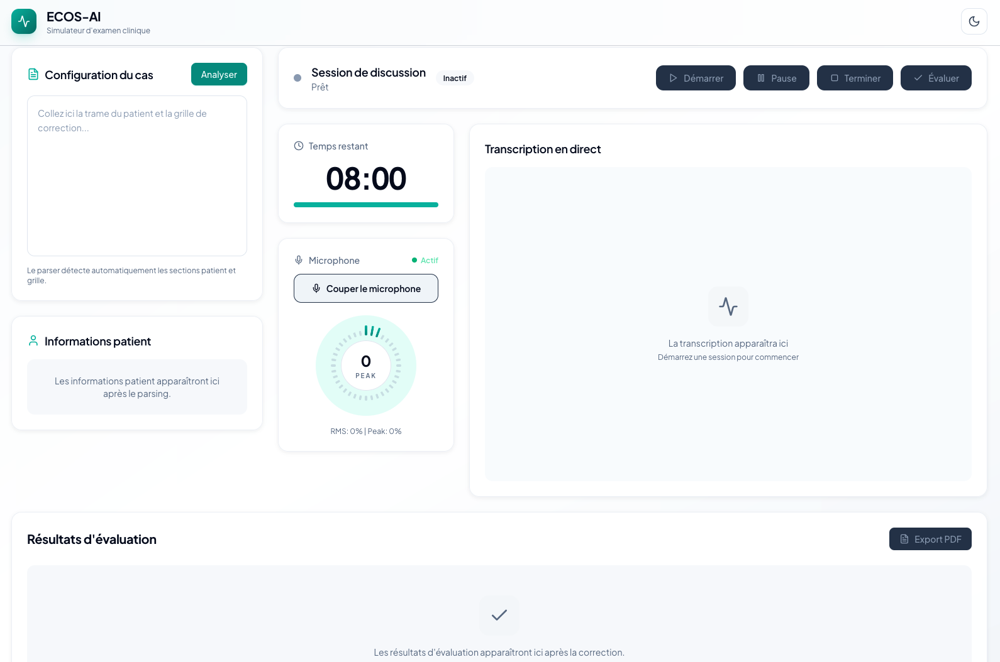

# ECOS-AI

Voice-first ECOS practice with a live AI patient, transcript review, audio replay, usage monitoring, AI-assisted transcript enhancement, and automatic grading against a case-specific correction grid.



## Overview

ECOS-AI is a local training app for medical students preparing oral ECOS stations. You paste station material, launch either a live simulated patient discussion or a monologue session, then review the transcript, replay the audio, and run a criterion-by-criterion evaluation.

The project follows a bring-your-own-key workflow: you run the app locally and use either a server Gemini key or your own local override from the settings drawer.

## What It Does

- Supports two station modes:
  - `PS / PSS`: live voice discussion with an AI patient using Gemini Live
  - `Sans PS`: monologue mode with silence-based student transcription
- Parses copied ECOS material into patient context and grading criteria.
- Displays the discussion transcript in real time, with configurable transcript and system-message visibility.
- Lets `Sans PS` optionally enhance the transcript with AI after the session ends, then use either the raw or corrected transcript as the evaluation source.
- Records the station audio for replay after the discussion ends.
- Evaluates student performance against the provided correction grid.
- Normalizes the final score from the observed criteria count so report totals stay consistent.
- Adds guardrails around very short discussions before evaluation starts.
- Exports formatted PDF reports with transcript, score, mode, and evaluation detail level.
- Includes both corrected and raw transcript variants in `Sans PS` PDF export when AI transcript correction is enabled.
- Tracks local API usage, token estimates, readiness state, and estimated spend in a dashboard drawer.
- Lets you configure timer defaults, auto-evaluation, playback speed, PDF export behavior, and feedback detail level.
- Lets you choose the patient voice in `PS / PSS`, with sex-guided auto-selection, favorites, and local preview samples.
- Uses consistent live audio capture settings across both modes, with smaller PCM chunks and aligned speech padding for more stable transcription.
- Ships a refined evaluation report with score-aware palette logic in light and dark mode.

## Current Focus

- Oral simulation rather than text-only interaction.
- Local usage with your own API key.
- Fast iteration on UI, scoring quality, realism, and operational guardrails.
- Hypocampus-style copy-paste workflows.

## Stack

- React
- TypeScript
- Vite
- Tailwind CSS
- Node.js
- Express
- Google Gemini Live API
- Google Gemini evaluation model

## Project Structure

```text
ECOS/
├── assets/
│   └── screenshots/
│       └── ecos-ai-ui.png
├── server/
│   ├── dashboard.ts
│   ├── evaluation.test.ts
│   └── index.ts
├── public/
│   └── voice-samples/
├── scripts/
│   └── generate_voice_samples.mjs
├── src/
│   ├── lib/
│   │   ├── audio.ts
│   │   ├── parser.ts
│   │   ├── pdf.ts
│   │   ├── settings.ts
│   │   └── voices.ts
│   ├── App.tsx
│   ├── DashboardDrawer.tsx
│   ├── PsPage.tsx
│   ├── SansPsPage.tsx
│   ├── SettingsDrawer.tsx
│   ├── index.css
│   ├── main.tsx
│   └── types.ts
├── tests/
│   └── e2e/
├── .github/
│   └── workflows/
│       └── ci.yml
├── .env.example
├── package.json
├── vite.config.ts
├── playwright.config.ts
└── README.md
```

## Setup

1. Clone the repository.
2. Install dependencies with `npm install`.
3. Create a `.env` file at the project root.
4. Add your Gemini configuration:

```env
GEMINI_API_KEY=your_api_key_here
GEMINI_EVAL_MODEL=gemini-2.5-flash
GEMINI_LIVE_MODEL=gemini-2.5-flash-native-audio-preview-12-2025
```

Optional:
- keep using the server key from `.env`
- or override it locally from the in-app settings drawer with a per-browser API key

## Run Locally

Start the app with:

```bash
npm run dev
```

This runs:

- the Vite frontend
- the Express backend

Typical local URLs:

- frontend: `http://localhost:5173`
- backend: `http://localhost:3001`

## Modes

### PS / PSS

- Parses patient metadata and correction grid.
- Starts a live AI patient conversation.
- Uses the selected patient voice for the live session.
- Pause now behaves like a true microphone mute and resume explicitly unmutes again.
- Preserves transcript, audio replay, PDF export, and evaluation workflow.

### Sans PS

- Extracts the grading grid only.
- Records a student monologue with silence-based transcription.
- Keeps the student monologue in a single merged transcript bubble instead of splitting it across multiple temporary bubbles.
- Preserves the last in-flight spoken segment on pause or mute before freezing the transcript.
- Can run an optional end-of-session AI transcript correction pass and evaluate from that corrected transcript.
- Reuses the same timer, transcript, replay, evaluation, PDF export, dashboard, and settings patterns.

## Settings

The settings drawer lets you configure:

- default timer duration
- auto-open evaluation after session end
- live transcript visibility
- system-message visibility
- auto-export PDF after evaluation
- feedback detail level
- recorded audio playback speed
- local Google API key override
- transcript visibility and system-message visibility for both modes

These settings are persisted in `localStorage`.

## Dashboard

The dashboard drawer provides a local operational view of API usage:

- readiness state: `Ready`, `At risk`, or `Blocked`
- token and estimated cost snapshots
- period filters: `1h`, `1j`, `7j`, `30j`
- live vs backend usage split
- last session usage
- key source and active models

Usage history is persisted locally by the backend in JSON so it survives server restarts. It only reflects usage performed through this app.

## Voice Selection

In `PS / PSS` mode:

- patient voice is auto-selected from parsed sex metadata
- the auto choice can be overridden after `Analyser` and before `Démarrer`
- voices can be previewed locally from bundled audio samples
- favorite voices can be marked in the selector

In `Sans PS` mode, the same selector layout remains visible but disabled to preserve the page structure.

## Typical Workflow

1. Choose `PS / PSS` or `Sans PS`.
2. Paste the station material into the input area.
3. Click `Analyser`.
4. In `PS / PSS`, optionally adjust the patient voice before starting.
5. Start the session and conduct the station orally.
6. Pause or end the station when appropriate.
7. In `Sans PS`, optionally run `Correct transcript with AI` after the monologue ends.
8. Review the transcript and replay the recorded audio.
9. Launch the evaluation and inspect the criterion-by-criterion feedback.
10. Export the PDF report if needed.

## Testing

Run the local checks with:

```bash
npm run build
npm run test
npm run test:e2e
```

The project includes:

- `Vitest` + Testing Library for component and logic regressions
- `Playwright` for end-to-end smoke coverage
- GitHub Actions CI on pushes and pull requests

## Notes

- Browser microphone permission is required.
- A stable internet connection is required for Gemini Live.
- Evaluation quality depends on transcript quality, grading prompt quality, and station structure.
- AI transcript correction is optional, useful for readability and evaluation support, and can still make mistakes.
- The original recorded audio remains the source to verify critical points when needed.
- This is a training tool, not a certified medical assessment platform.

## Limitations

- Parsing still expects relatively structured source material.
- Case ingestion is currently optimized around Hypocampus-style formatting.
- Very short discussions may produce unreliable evaluation signals.
- Dashboard usage and spend remain app-local estimates, not official provider billing counters.
- AI grading is useful for training, but it is not a formal examiner.

## Roadmap

- Persistent session history and richer dashboard analytics
- Better quota/readiness preflight and usage visibility
- More robust parsing across different ECOS content sources
- More complete local voice preview coverage
- Expanded support for specialty-specific stations

## Author

Built as an experimental voice-first ECOS simulator for clinical communication training.
